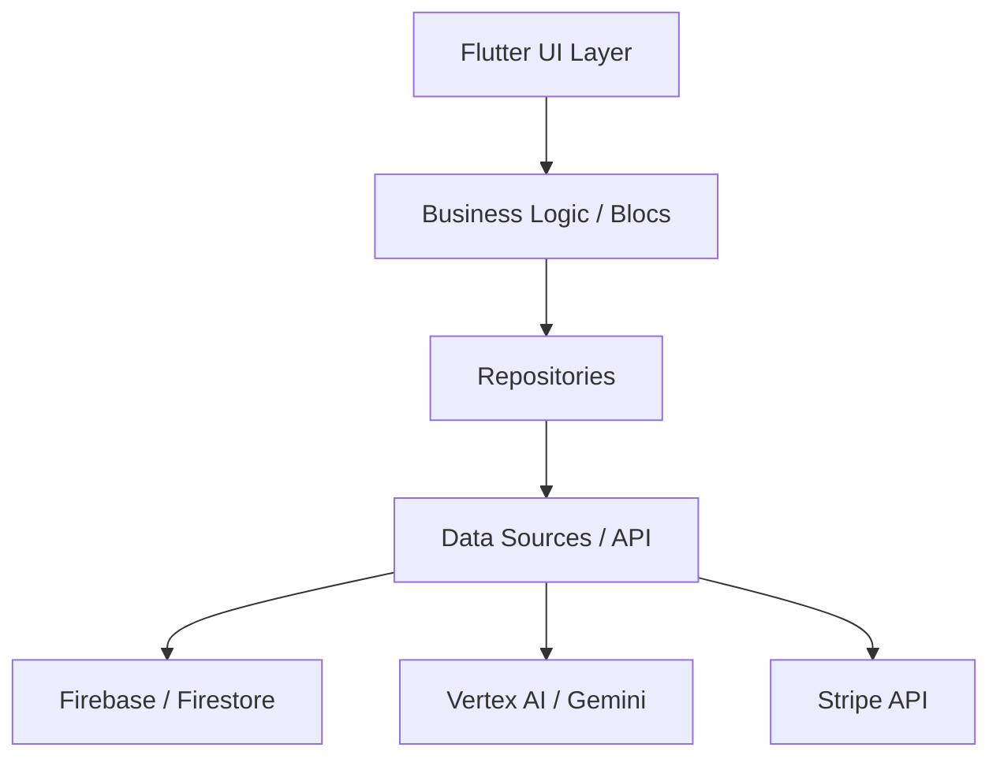

# Phonics Kids Pro 🍎📚

**Interactive Phonics Learning Powered by AI**

Phonics Kids Pro is a state-of-the-art educational application designed to revolutionize how children learn to read and write. By combining interactive lessons, engaging animations, and cutting-edge AI feedback, we provide a personalized learning journey that accelerates literacy development.

---

## 🎯 Intention & Mission

Our mission is to make high-quality phonics education accessible, engaging, and personalized. We believe that every child deserves a strong foundation in literacy, and Phonics Kids Pro is built to bridge the gap between traditional learning and modern technology.

- **Engagement**: Using Rive animations to bring characters and lessons to life.
- **Personalization**: AI-driven assessments that adapt to each child's pace.
- **Accessibility**: Multi-platform support (Android/iOS) ensuring learning never stops.

---

## 🚀 Key Features

- **Interactive Phonics Lessons**: Cover everything from basic letter sounds to complex blends.
- **AI Pronunciation Feedback**: Utilizes Google Vertex AI (Gemini) to analyze and guide speech.
- **Teacher & Parent Dashboards**: Detailed progress tracking and classroom management for schools.
- **Rewards & Gamification**: Badge systems and interactive rewards to keep kids motivated.
- **School Integration**: Specialized tiers for educational institutions to manage multiple classrooms.

---

## 🛠 Technology Stack

Phonics Kids Pro is built with a premium, scalable, and secure stack:

- **Frontend**: [Flutter](https://flutter.dev/) (Cross-platform Dart framework)
- **Backend/Database**: [Firebase](https://firebase.google.com/) (Firestore, Auth, Cloud Functions)
- **AI Engine**: [Google Vertex AI / Gemini 1.5 Flash](https://cloud.google.com/vertex-ai)
- **Payments**: [Stripe](https://stripe.com/) (Secure global payments)
- **Animations**: [Rive](https://rive.app/) (High-performance vector animations)
- **Typography**: Google Fonts (Inter, Madimi One)

---

## 🏗 Architecture

The project follows a **Clean Architecture** pattern, ensuring separation of concerns and testability.

### High-Level Architecture

### Module Structure
- `lib/src/auth`: User authentication, registration, and subscription gating.
- `lib/src/learning`: Core phonics lessons, models, and AI scoring services.
- `lib/src/school`: Classroom management, teacher dashboards, and school-specific logic.
- `lib/src/core`: Common utilities, theme, and global configurations.
- `lib/src/tracking`: Progress analytics and user activity monitoring.

---

## 📱 Market & Accessibility

- **Target Audience**: Children (3-8 years), Parents looking for home learning, and Teachers/Schools.
- **Google Play & App Store**: Available on Android and iOS (Native performance).
- **Web Support**: Optimized for web usage in classroom environments.
- **Global Reach**: Designed for international phonics standards.

---

## 💳 Payment Plans

| Tier | Price | Target | Key Features |
| :--- | :--- | :--- | :--- |
| **Basic** | Free | Explorers | Limited lessons, basic tracking. |
| **Pro Monthly** | $4.99/mo | Parents | Full content, AI feedback, 1 child. |
| **Pro Annual** | $39.99/yr | Parents | Save 30%, full content, 1 child. |
| **School** | $99.00/yr | Educators | Unlimited students, teacher dashboard. |

---

## 💰 Financial Valuation & ROI (Investor Insight)

Phonics Kids Pro is designed for high margins and scalability. Below is the projected monthly cost analysis per 1,000 active users (MAU).

### Monthly Operating Costs (OPEX)
| Category | Service | Basis | Estimated Cost (per 1k users) |
| :--- | :--- | :--- | :--- |
| **Cloud Infra** | Firebase/Firestore | Pay-as-you-go | $15 - $25 |
| **AI Intelligence** | Google AI (Gemini) | ~20 prompts/user | $10 - $15 |
| **Transactions** | Stripe | 2.9% + $0.30 | Integrated in revenue |
| **Maintenance** | CI/CD & APIs | Static/Free quota | $0 (Free Tier) |
| **Total OPEX** | | | **$25 - $40** |

### Projected Margins
- **CAC (Customer Acquisition Cost)**: Targeted at $0.50 - $1.20 via educational channels.
- **LTV (Lifetime Value)**: Projected at $60 (Average 1.5 years subscription).
- **Gross Margin**: **~85% - 92%** (Post-Stripe and Cloud fees).

> [!IMPORTANT]
> The leverage of **Gemini 1.5 Flash** provides enterprise-grade AI pronunciation feedback at a fraction of the cost of traditional speech-to-text APIs, significantly increasing profit margins.

---

## 🏗 Build & Installation

### Prerequisites
- Flutter SDK (Latest stable)
- CocoaPods (for iOS/macOS)
- Firebase CLI (for backend updates)

### Setup
1. Clone the repository: `git clone <repo-url>`
2. Install dependencies: `flutter pub get`
3. Configure Firebase: Run `flutterfire configure`
4. Deploy Cloud Functions: `cd functions && npm install && firebase deploy --only functions`
5. Run the app: `flutter run`

---

## 🛠 Development Workflow
We use **Main Channeling** with feature flags for production stability.
- `main_dev.dart`: Development environment (Firebase Emulators).
- `main_prod.dart`: Production environment (Live Firebase/Stripe).
